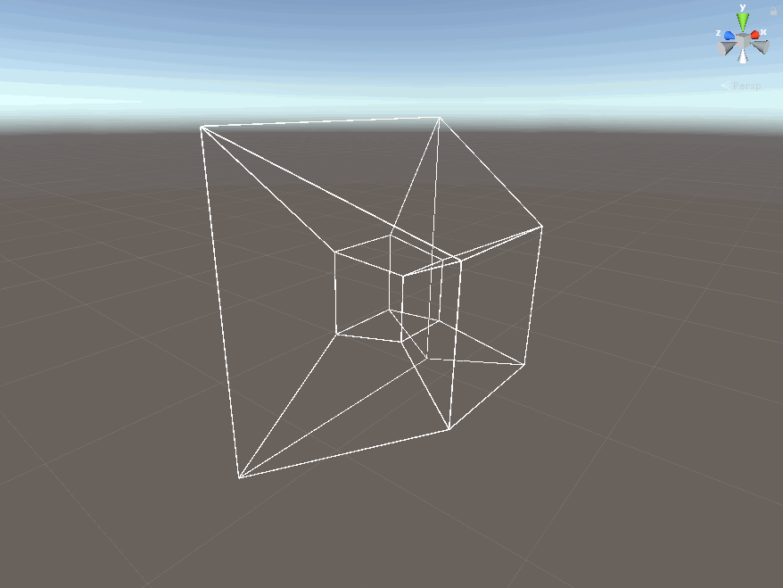

A hypercube performing a ZW rotation. Created using our mesh4 class.

# 4D_VR_Shape_Sandbox
A virtual reality physics engine built on top of Unity where the player can interact and play with 4 dimensional shapes in a sandbox environment.

Current State of Game:

The Mesh4 class's framework is mostly complete. It is capable of taking an array of verticies and another array describing the connections between those vertices and then creating a 4D shape. This 4D shape can be projected into a 3D stereographic projection. Othrographic projection is currently being worked on. The 4D shape can be translated and 2-coordinate-rotated in 4D allowing you to observe its effect on the 3D stereographic projection. A 2 coordinate rotation is a traditional 3D rotation about an axis. In 4D the idea of a line axis breaks down and thus this rotation must be thought about as a "pair rotation", or just changing 2 coordinates at the same time using a 4D rotation matrix derived from the traditional 3D rotation matrix. The reason we must specify this as a "pair rotation" is because 4D opens up the idea of a "triplet rotation" where 3 coordinates change at the same time. We are still working on developing the matrix transformation for this type of rotation. It appears that this type of rotation is interwoven with the 4D tensor of inertia, cross-like product, torque, and mass calculation. According to other research, a 4D cross product does not exist. Thus we are trying to find another way to relate external force to torque to then rotation. Many of the other 4D concepts we have discussed follow from the 3D counterpart. However, due to the abstraction of rotation caused by adding another dimension, all rotational quantities have proven difficult to find through extrapolation of 3D quantities. We have found a lot of success by analyzing patterns in how quantifiers change as dimensions are added. By playing around with the intuition gained through these patterns we are able to find intersting and unique structures that are oddly similar to structures we have seen before. For example, many interesting matrix structres have been stumbled upon while trying to determine how to represent the tensor of inertia in 4D.

We also have a 4D rigidbody component with translational and some rotational movement working as well as a other helper classes.

List of concepts/goals/features:
4verties and line connections
stereographic projection
othographic projection
translational movement
pair rotation
triplet rotation
tensor of inertia
center of mass
volume
mass
collision detection
collision reaction
faces/tetrahedrons
autogenerating faces/tets and line connections
shading/rendering
player input for 4 dimensions
VR support (will come last)
VR physics interaction
malluable shapes
user entered shapes
shape editor
levels/puzzles using the 4th dimension
4d user
4d slider
4d slider variations of control

